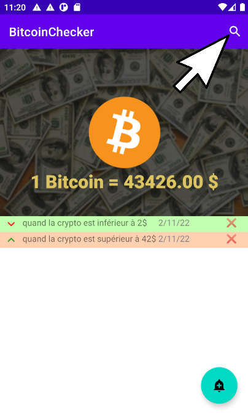

# BitcoinChecker

## Contexte de l'application

Ce projet consiste à réaliser une application en Kotlin pour le système Android.
Cette application doit permettre à un utilisateur de consulter le cours des cryptomonnaies disponibles sur le marché en temps réel.
L'utilisateur doit également pouvoir programmer des alertes qui seront lancée lorsque la cryptomonnaie atteint un certain seuil. Cette alerte est affichée à l'utilisateur sous la forme d'une notification. Voici la liste des actions que peut réaliser l'utilisateur sur une notification : 
- Créer la notification
- Supprimer la notification
- Consulter la notification en fonction de la cryptomonnaie sélectionnée

## Sketchs préliminaires

## Bibliothèque utilisées

- com.fasterxml.jackson.module:jackson-module-kotlin:2.8.+
- androidx.core:core-ktx:1.7.0
- androidx.appcompat:appcompat:1.4.0
- androidx.fragment:fragment-ktx:1.4.0
- com.google.android.material:material:1.4.0
- androidx.constraintlayout:constraintlayout:2.1.2
- androidx.recyclerview:recyclerview:1.2.1
- androidx.cardview:cardview:1.0.0

## Utilisation de l'API

### Paramétrage à réaliser pour l'installation

Pas de paramétrage à réaliser. En effet, l'API utilisée est open-source et n'utilise pas de système d'authentification pour pouvoir s'y connecter (token, mot de passe ...).

### A quoi sert l'API ?

L'application doit contacter une API REST afin de récupérer la liste des cryptos existantes. Une fois cette liste récupérée, l'utilisateur sélectionne la crypto qui l'intéresse. L'API REST est alors contactée une nouvelle fois afin de récupérer des informations sur la crypto sélectionnée :

- Le nom de la crypto
- La valeur courante en dollars
- Le logo de la crypto
- L'identifiant de la crypto

Pour contacter cette API, il suffit de renseigner l'URL car les paramètres de la requête sont directement passés via l'URL. 

## Rendu final

Clique sur le bouton en bas à droite de l'activité principale pour ajouter une notification :
  

 
 
Renseigner les différents paramètres de la notification à ajotuer :
 

 
 
Appuyer sur la loupe dans la barre de navigation pour rechercher une crypto :
 

 
 
Lorsque plus de deux lettres sont renseignées, les suggestions de cryptos apparaissent : 
 

 
 
Lorsque le nom de la crypto est validé, l'activité principale passe sur la nouvelle crypto avec les potentielles notifications associées : 
 

  
Envoie d'une notification lorsque la condition est validée : 
 

